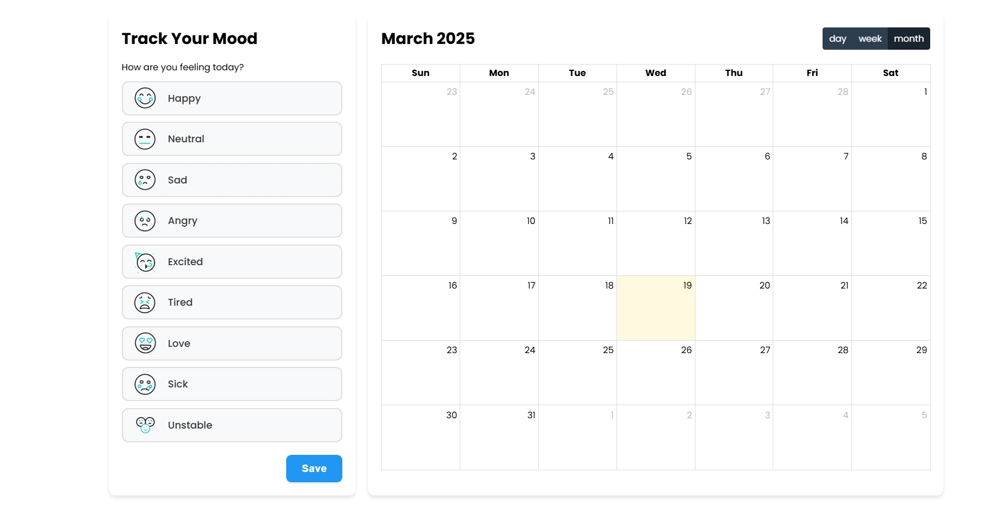
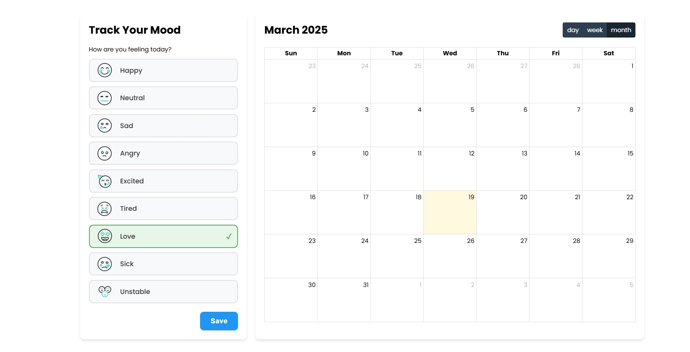
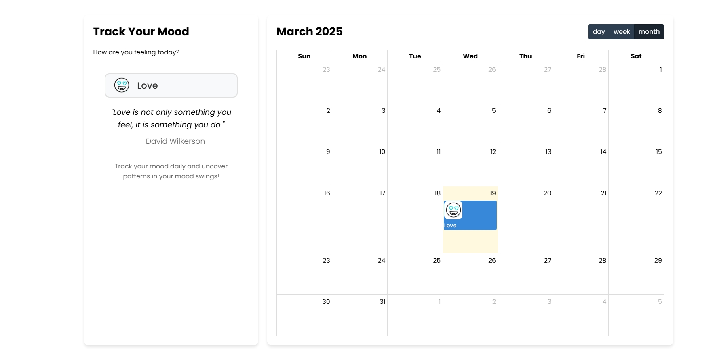
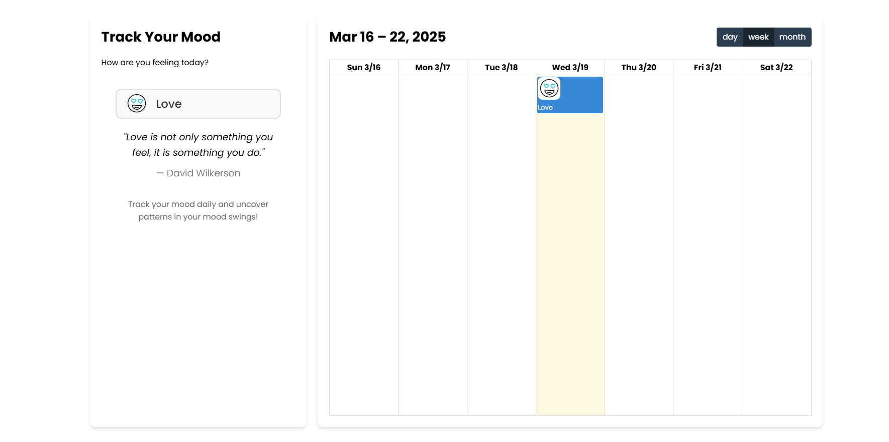
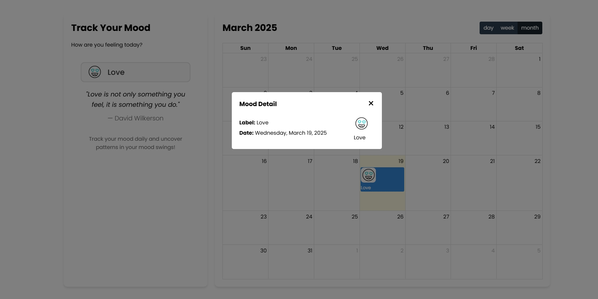

# Daily Mood Tracker

This project allow users to track their mood on daily basis using local storage of browser and provide feature to view log on daily, weekly and monthly basis with quote related to mood.

## Table of Contents

- [Daily Mood Tracker](#daily-mood-tracker)
  - [Table of Contents](#table-of-contents)
  - [Features](#features)
  - [Technologies Used](#technologies-used)
  - [Installation](#installation)
  - [Usage](#usage)
  - [Note](#note)

## Features

- **Responsive Design**: The project adjusts its layout based on the screen size, ensuring a great user experience on both desktop and mobile devices.
- **Modern UI**: Clean and visually appealing design using the Poppins font.
- **Interactive Elements**: Users can interact through different mood emoji.

## Technologies Used

- **HTML5**: For the structure of the project.
- **CSS3**: For styling and responsive design.
- **JavaScript**: For interactive elements.
- **Full Calendar JS Plugin**: Utilizes the Fullcalendar.js plugin for the showing events in calendar.

## Installation

1. Clone the repository:
   ```bash
   git clone https://github.com/Depkstha/mood-tracker.git
   ```

2. Navigate into the project directory:
   ```bash
   cd mood-tracker
   ```

3. Open `index.html` in your web browser to view the project.

## Usage

- The tracker displays you mood log using different emoji and label.
- Users can interact with the calendar by clicking on event on calendar.

## This is what it looks like






## Note
This project is part of the fulfillment of an assignment provided by Cohort on Masterji. Thank you Hitesh sir, Piyush sir, TA's and entire team for running such wonderful cohort successfully. I am very happy that I can be part of it. Love and support from Nepal.
